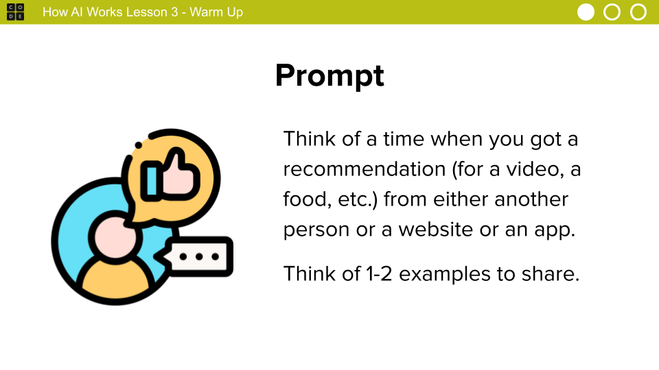
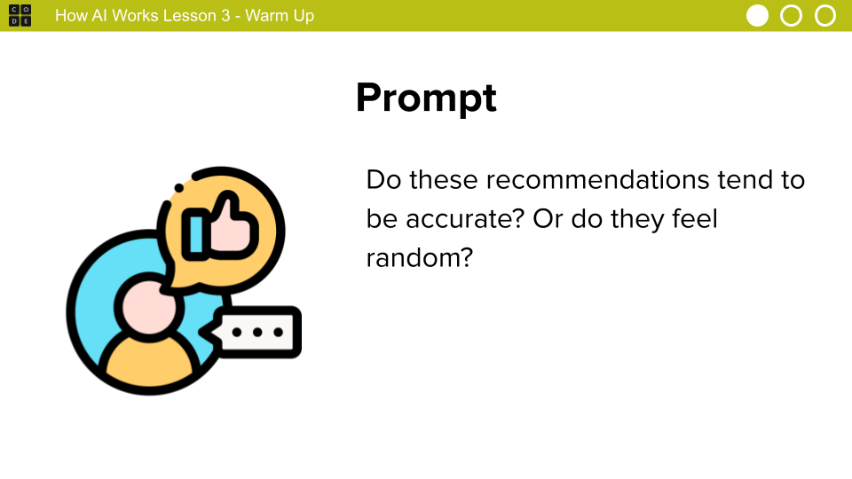
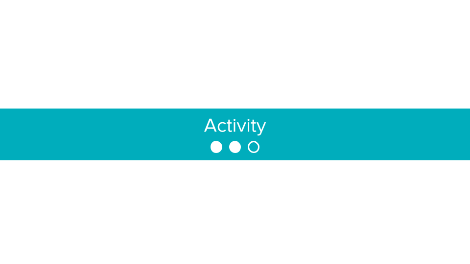
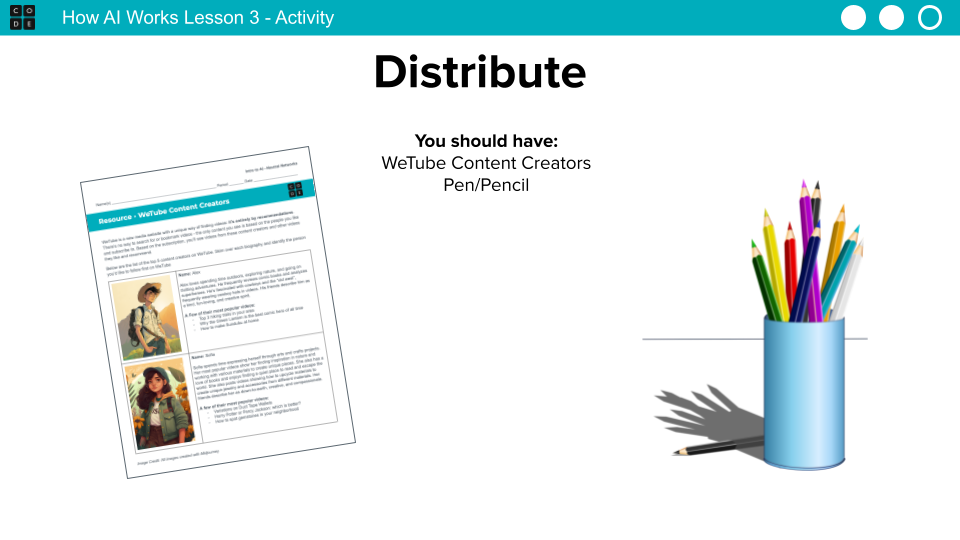
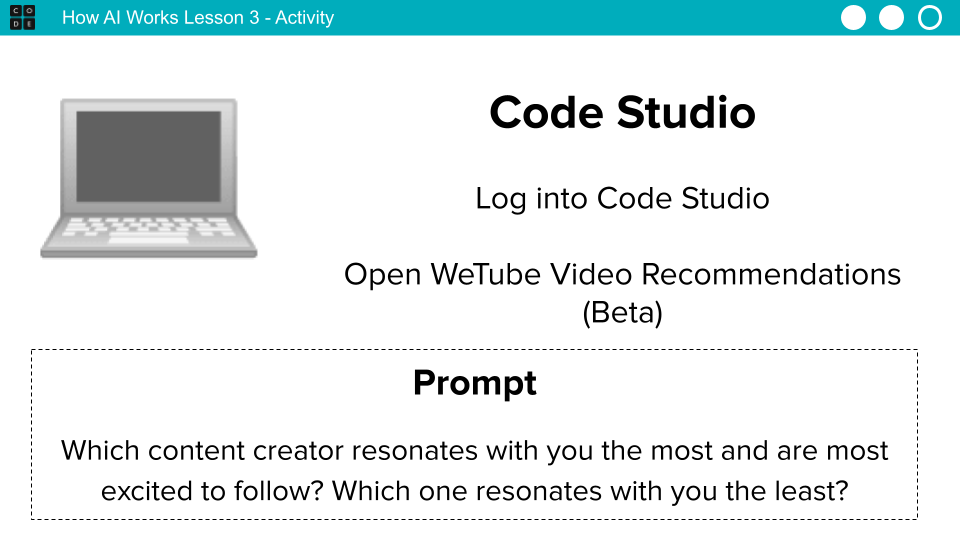
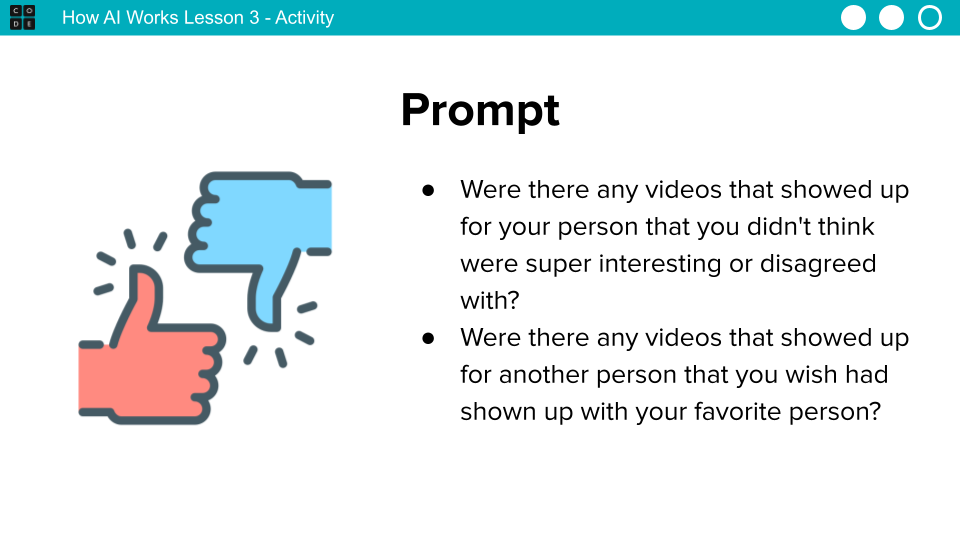
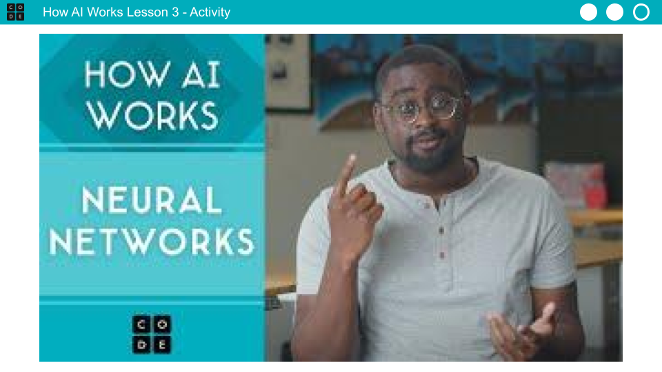

# lesson-plan

Slides and Notes

|  | **Lesson Overview** This lesson centers around the How AI Works: Neural Networks video from the How AI Works video series. Watch this video first before exploring the lesson plan. Students learn how neural networks work. They first discuss an example of an experience that recommends things to you. They then use a widget that recommends videos based on one person. Students watch a video explaining neural networks. They use an updated widget to adjust the weights of each person. Finally, students discuss the need for diverse perspectives when creating recommendation systems. More guidance and resources for this lesson are available in the Lesson Plan: https://studio.code.org/s/how-ai-works-2023/lessons/3                                                                                                                                                                                                                                                                                                                                                                            |
| --------------- | ------------------------------------------------------------------------------------------------------------------------------------------------------------------------------------------------------------------------------------------------------------------------------------------------------------------------------------------------------------------------------------------------------------------------------------------------------------------------------------------------------------------------------------------------------------------------------------------------------------------------------------------------------------------------------------------------------------------------------------------------------------------------------------------------------------------------------------------------------------------------------------------------------------------------------------------------------------------------------------------------------------------------------------------------------------------------------------------------------------------ |
|  |                                                                                                                                                                                                                                                                                                                                                                                                                                                                                                                                                                                                                                                                                                                                                                                                                                                                                                                                                                                                                                                                                                                    |
|  | **Discussion Goal:** Encourage students to think of things that make recommendations, especially different apps or websites. For example, they may be recommended videos from Youtube or new songs on a music app. Some apps may ask you to pick preferences before using them to help figure out your preferences. Some websites give recommendations at the end of an experience, like a takeout menu or online grocery store recommending new items before checking out. Try to crowdsource a variety of examples before continuing to the next prompt                                                                                                                                                                                                                                                                                                                                                                                                                                                                                                                                                          |
|  | 
<strong>Discussion Goal:</strong> Responses here will vary, and there's no expected answer. Instead, focus on the tension between getting recommendations that are accurate and how not every recommendation may feel like it matches each student's interests and personality.

Remarks We get recommended things all the time, but how do these programs know what to recommend? How do they get better? Today we're going to look at one way computers create recommendations using something called neural networks.
                                                                                                                                                                                                                                                                                                                                                                                                                                                                                                                                                                               |
|  |                                                                                                                                                                                                                                                                                                                                                                                                                                                                                                                                                                                                                                                                                                                                                                                                                                                                                                                                                                                                                                                                                                                    |
|  | Distribute: Pass out the WeTube Content Creators resource.                                                                                                                                                                                                                                                                                                                                                                                                                                                                                                                                                                                                                                                                                                                                                                                                                                                                                                                                                                                                                                                         |
|  | 
Model: Show students the widget and demonstrate how to select a person and then view the video recommendations.

Show students the introductory text, then click the "Let's Get Started" button to see the main screen On the second screen, you can click on individuals to learn more about them. This is the same information that's in the level instructions and on the handout. Once you've chosen a person, click the See Recommendations button at the bottom of the screen This third screen shows the "video feed" that would appear based on this person's interests. The white boxes show video tiles, and the purple buttons can be used to scroll through multiple videos Clicking the orange buttons on the left will filter the videos by certain categories. This is an easy way to show how preferences can change from one person to another. After exploring some of the videos from the person you chose, click the "Select New Person" button at the bottom of the screen. Select a new person and repeat the process: show which videos have been selected with this new person
 |
|  | 
Code Studio: Send students to the first level in Code Studio. As they work, have them consider the following prompt

Circulate: Walk around as students experiment with the app. Make sure they understand the interface - that after choosing a content creator, they see a list of video recommendations they can explore. Encourage students to explore different content creators and see what videos are recommended. Students should notice that the videos seem to match the personalities of each person with some variation. Once most students have looked at a few content creators, regroup the class.
                                                                                                                                                                                                                                                                                                                                                                                                                                                                                     |
|  | 
Regroup: Have students regroup to discuss the following prompt

Remarks It’s super unlikely that just subscribing to 1 person will give you the ideal recommendations - there may be some things here that you actually don’t like, and you’d rather do something that a different user recommended instead. There’s gotta be a way to combine these different perspectives to fine-tune the recommendations that we get. Let’s look at how computer science and artificial intelligence can help with that!
                                                                                                                                                                                                                                                                                                                                                                                                                                                                                                                                                                                           |
|  | Video: Show the How AI Works: How Neural Networks Work                                                                                                                                                                                                                                                                                                                                                                                                                                                                                                                                                                                                                                                                                                                                                                                                                                                                                                                                                                                                                                                             |
